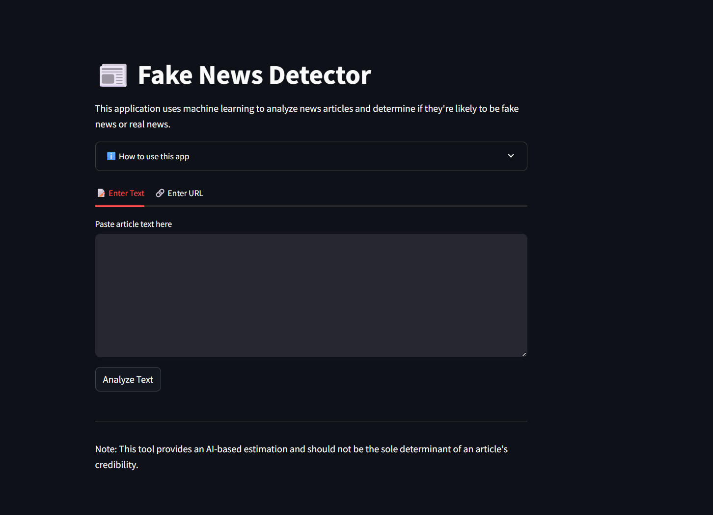

# 📰 FAKE NEWS DETECTOR

A machine learning-based web app that detects fake news using natural language processing (NLP) and ensemble classification models. Built using Python, Scikit-learn, NLTK, and deployed via Streamlit.

---

## 🔍 Overview

Fake news has become a major concern in the digital age. This project offers an automated solution to detect whether a given news article is **real** or **fake** based on its textual content. It uses multiple supervised learning models and a stacking ensemble for high accuracy, with a user-friendly web interface.

---

## 🚀 Features

- Detects fake news using classical ML and NLP
- Interactive web interface built with Streamlit
- Ensemble model (Stacking Classifier) for improved accuracy
- Real-time predictions for user-input news text
- Model trained on a well-balanced labeled dataset

---

## 🧠 Tech Stack

- **Language**: Python 3.10
- **Libraries**:
  - `scikit-learn`
  - `pandas`
  - `nltk`
  - `joblib`
  - `requests`
  - `beautifulsoup4`
  - `streamlit`
- **Deployment**: Streamlit

---

## 🗃️ Dataset

- Source: [Kaggle - Fake News Dataset by William Lifferth](https://www.kaggle.com/c/fake-news/data)
- Format: CSV
- Labels: `real`, `fake`
- Preprocessing includes:
  - Lowercasing
  - Tokenization
  - Stop-word removal
  - Stemming (PorterStemmer)
  - TF-IDF Vectorization

---

## 🧪 Models Used

- **Logistic Regression**
- **Decision Tree Classifier**
- **Naive Bayes**
- **Support Vector Machine**
- **Stacking Classifier (meta: Logistic Regression)**

🏆 **Best accuracy**: 97.04% (with stacking ensemble)

---

## 💻 How to Run

1. Clone the repository:
    ```bash
    git clone https://github.com/SDugtal/FAKE-NEWS-DETECTOR.git
    cd FAKE-NEWS-DETECTOR
    ```

2. Install the required libraries:
    ```bash
    pip install -r requirements.txt
    ```

3. Run the app:
    ```bash
    streamlit run app.py
    ```

4. Paste a news article in the input box and hit **Predict**!

---

## 📸 Screenshots

> *()*

---

## 📈 Evaluation Metrics

- Accuracy
- Precision
- Recall
- F1-Score
- Confusion Matrix
- ROC Curve & AUC

---

## 📌 Future Improvements

- Add support for multiple languages
- Integrate BERT or Transformer models
- Extend detection to images/videos (multimodal)
- Auto-update with new fake news trends via scraping
